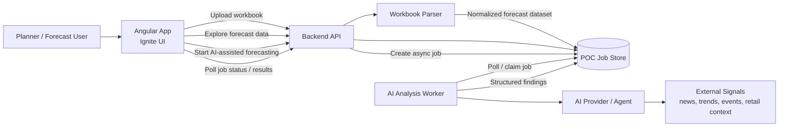
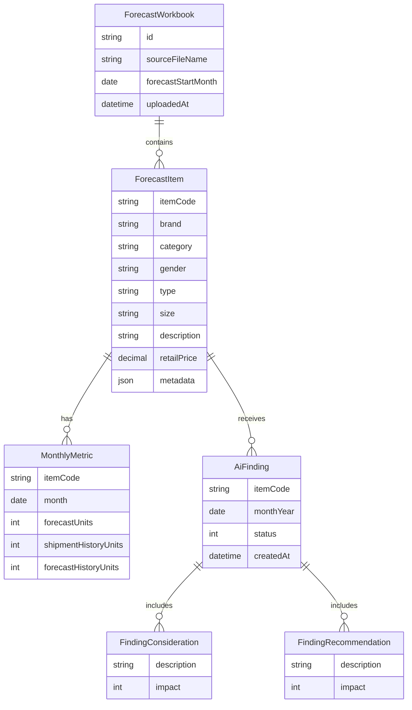
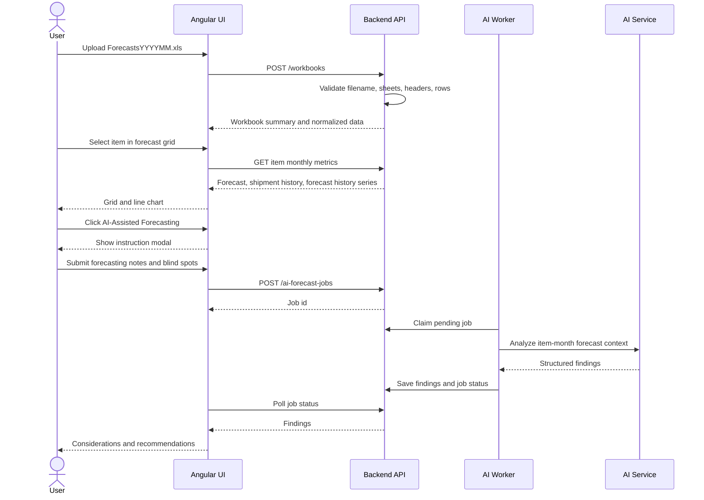
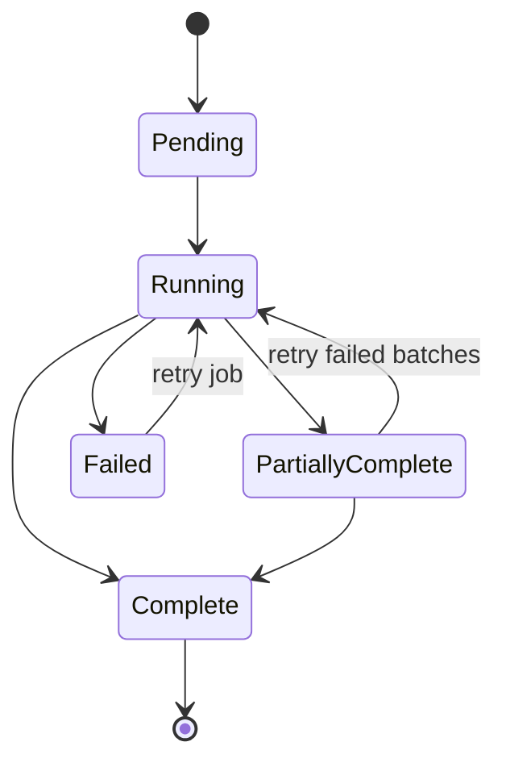

# Forecast AI Proof of Concept Implementation Plan

## Goal

Build an Angular proof of concept that lets a fragrance distributor upload a forecast workbook, inspect forecast data, compare selected products against historical shipments and prior forecast history, and run an asynchronous AI-assisted forecasting analysis that returns normalized considerations and recommendations.

The POC should prove three things:

1. The workbook can be reliably parsed into a normalized forecast model.
2. The user can explore item-level forecast context in an Ignite UI-based interface.
3. AI-generated demand considerations can be produced in a structured format suitable for later database persistence.

## Product Context

The app is intended as an ERP extension for a US-based fragrance distributor selling primarily to brick-and-mortar retailers such as department stores.

Forecast adjustments may be influenced by product metadata, shipment trends, prior forecast accuracy, retail timing, seasonal fragrance demand, promotional timing, regional issues, celebrity or brand events, sentiment, and qualitative product attributes that are not obvious from the item name alone.

## Proposed Architecture

The POC should use a small client/server architecture rather than putting all parsing and AI work in the browser. The browser should handle upload, exploration, and job status. The backend should own workbook parsing, validation, AI orchestration, and future persistence integration.



## Technology Choices

| Area | Recommendation | Notes |
| --- | --- | --- |
| Frontend | Angular | Matches project requirement. |
| UI components | Ignite UI for Angular | Use Ignite UI grid, chart, dialog, inputs, buttons, progress indicators, and layout controls. |
| Backend | ASP.NET Core, Node.js, or Python FastAPI | Pick based on the surrounding ERP ecosystem. For a POC, FastAPI or Node.js is fast to iterate; ASP.NET Core may fit better if the ERP stack is Microsoft-heavy. |
| Workbook parsing | Backend library | Prefer server-side parsing so validation and import behavior are controlled. |
| Async work | Background worker plus job table/store | Avoid blocking the upload/exploration request while AI analysis runs. |
| Persistence | Start with file/in-memory/SQLite POC store | Replace with the future API/database once specified. |
| AI integration | Provider-isolated service | Keep prompts, search/retrieval tools, model calls, and schema validation behind a backend service boundary. |

## Workbook Contract

Expected filename:

```text
ForecastsYYYYMM.xls
```

Example:

```text
Forecasts202505.xls
```

This means the workbook forecast context starts in May 2025.

Expected sheets:

| Sheet | Required | Purpose |
| --- | --- | --- |
| `Items` | Yes | Item master and product metadata. |
| `Shipments History` | Yes | Units shipped for the past 12 months. |
| `Forecasts` | Yes | Forecast units for upcoming months. |
| `Forecast History` | Yes | Prior forecast values for past months. |

Parsing rules:

- Header row starts on row 2.
- Data starts on row 3.
- Column A contains the item code on every sheet.
- Month columns use compact prefixes:
  - `SYYMM` for shipments history.
  - `FYYMM` for forecast.
  - `HYYMM` for forecast history.
- Item metadata columns are dynamic after column A and should be preserved as key/value attributes.
- Blank or zero retail price values are valid and may indicate samples, testers, or promotional support items.

## Normalized Data Model

The import should convert workbook sheets into a model shaped for UI exploration and AI analysis.



For each item and month, align the series as:

- `forecastUnits`: target forecast month.
- `shipmentHistoryUnits`: same relative month from the shipment history window.
- `forecastHistoryUnits`: same relative month from the forecast history window.

The importer should retain source column names and parsed ISO month values so import errors can be traced back to workbook columns.

## User Workflow



## Frontend Plan

The Angular app should have three primary views for the POC.

### 1. Upload View

Controls:

- Ignite UI file input or styled upload control.
- Import summary panel.
- Validation error grid when the workbook cannot be imported.

Behavior:

- Accept `.xls` initially because the sample file uses that extension.
- Validate filename before upload where possible.
- Send the workbook to the backend for authoritative parsing.
- Show sheet counts, item count, forecast month range, and validation warnings after import.

### 2. Forecast Exploration View

Controls:

- Ignite UI grid for forecast rows.
- Ignite UI chart for selected item series.
- Filtering controls for brand, category, gender, type, and item code.
- Selection state for the active item.
- `AI-Assisted Forecasting` button.

Grid should include:

- Item code.
- Description.
- Brand/category/type/size.
- Retail price.
- Forecast month columns or summarized forecast totals.
- Optional flags for missing metadata, zero price, or unusually large changes.

Chart should compare:

- Upcoming forecast.
- Shipments history.
- Forecast history.

### 3. AI Findings View

This can start as a panel below the chart or a separate tab in the exploration view.

Controls:

- Job status/progress indicator.
- Findings grid grouped by item and month.
- Consideration and recommendation detail panels.
- Impact filter or sort.

Impact scale:

- Use a signed integer for `impact`.
- Suggested POC range: `-3` to `3`.
- Negative values indicate downward demand pressure.
- Positive values indicate upward demand pressure.
- Zero indicates neutral or watch-only context.

## AI-Assisted Forecasting Modal

The modal should explain that the user is giving the AI context about how the forecast was prepared. It should collect:

- Forecasting method: free text.
- Key assumptions already considered: free text.
- Known promotions, retailer events, or constraints: free text.
- Blind spots or topics the user specifically wants checked: free text.
- Optional region/market notes: free text.

The modal should make clear that generated findings are decision support, not an automatic forecast replacement.

## AI Job Design

The AI job should operate on batches, not one giant prompt. Batching reduces cost, makes retries possible, and prevents one bad item from failing the entire run.

Recommended job stages:

1. Create job with workbook id, user notes, and selected item scope.
2. Build item-month analysis tasks from forecast rows.
3. Enrich each task with item metadata and monthly metrics.
4. Retrieve or research relevant external context where enabled.
5. Ask the AI service for structured findings.
6. Validate the model output against the required schema.
7. Save valid findings.
8. Mark failed tasks individually and expose retry status.



## AI Input Contract

Each item-month task should include:

```json
{
  "item": {
    "itemCode": "string",
    "description": "string",
    "brand": "string",
    "category": "string",
    "gender": "string",
    "type": "string",
    "size": "string",
    "retailPrice": 0,
    "metadata": {}
  },
  "monthYear": "2025-05-01",
  "metrics": {
    "forecastUnits": 0,
    "shipmentHistoryUnits": 0,
    "forecastHistoryUnits": 0
  },
  "userContext": {
    "forecastingMethod": "string",
    "knownAssumptions": "string",
    "knownPromotionsOrConstraints": "string",
    "blindSpots": "string",
    "regionMarketNotes": "string"
  }
}
```

## AI Output Contract

The normalized output should match the requested shape exactly, with ISO-formatted month values.

```json
{
  "item": "string",
  "monthYear": "2025-05-01",
  "considerations": [
    {
      "description": "string",
      "impact": 1
    }
  ],
  "recommendations": [
    {
      "description": "string",
      "impact": 1
    }
  ]
}
```

Validation rules:

- `item` must match an imported item code.
- `monthYear` must be an imported forecast month.
- `considerations` and `recommendations` must be arrays.
- `description` must be non-empty.
- `impact` must be an integer in the accepted range.
- Outputs should be rejected or repaired if they include unstructured prose outside the schema.

## External Context Strategy

For the POC, separate external context into categories so each source can be enabled, disabled, cached, or replaced later.

| Category | Example Signals | POC Handling |
| --- | --- | --- |
| Calendar and seasonality | Holidays, Mother's Day, Father's Day, holiday shopping | Deterministic calendar library or static table. |
| Retail macro context | Consumer confidence, retail sales sentiment, inflation sensitivity | Start with curated summaries or manual input; automate later. |
| Brand and celebrity signals | Launches, campaigns, public figures, entertainment releases | AI/search tool enrichment with source capture. |
| Regional issues | Weather, political unrest, local disruptions, major events | Optional region input from the user. |
| Product metadata trends | Color, ingredient, fragrance family, packaging, gender positioning | Use item metadata as explicit AI context. |
| Promotional opportunities | Tester/sample strategy, gift-with-purchase, counter merchandising | AI recommendations based on metadata and forecast deltas. |

For production, every externally sourced finding should keep source metadata. The initial requested output does not include sources, but the backend should internally preserve them to support auditability.

## API Surface

Suggested POC endpoints:

| Method | Route | Purpose |
| --- | --- | --- |
| `POST` | `/api/workbooks` | Upload and parse workbook. |
| `GET` | `/api/workbooks/{id}` | Get workbook summary. |
| `GET` | `/api/workbooks/{id}/items` | Get normalized forecast item rows. |
| `GET` | `/api/workbooks/{id}/items/{itemCode}/metrics` | Get chart series for one item. |
| `POST` | `/api/workbooks/{id}/ai-jobs` | Start AI-assisted forecasting job. |
| `GET` | `/api/ai-jobs/{jobId}` | Get job status and progress. |
| `GET` | `/api/ai-jobs/{jobId}/findings` | Get normalized AI findings. |

## Implementation Phases

### Phase 1: Documentation and Project Setup

- Confirm backend stack.
- Scaffold Angular app.
- Add Ignite UI for Angular.
- Add backend API project.
- Define shared contracts for workbook summary, forecast item, monthly metric, AI job, and AI finding.

### Phase 2: Workbook Import

- Implement upload endpoint.
- Parse filename into forecast start month.
- Parse four required sheets.
- Convert compact month headers into ISO month values.
- Join sheets by item code.
- Return workbook summary and validation errors.
- Add importer tests using `data/Forecasts202505.xls`.

### Phase 3: Forecast Exploration UI

- Build upload screen.
- Build forecast grid.
- Build selected-item chart.
- Add filters and item selection.
- Add loading and validation states.

### Phase 4: AI Job Workflow

- Build AI-assisted forecasting modal.
- Implement job creation endpoint.
- Add background worker.
- Create item-month batches.
- Add structured AI output validation.
- Display job status and findings.

### Phase 5: Forecast Findings UX

- Group findings by item and month.
- Show considerations and recommendations separately.
- Add impact sorting/filtering.
- Add item-level summary counts and net impact indicators.
- Add export option if useful for ERP handoff.

### Phase 6: Future Persistence Integration

- Replace POC store with database/API integration.
- Persist workbook imports, item snapshots, job metadata, and findings.
- Add authentication and authorization if this becomes more than a local demo.

## Key Risks and Decisions

| Risk / Decision | Recommendation |
| --- | --- |
| Workbook variability | Validate aggressively and show actionable import errors. |
| `.xls` parsing support | Confirm backend library supports legacy Excel files, or convert to `.xlsx` during import. |
| AI hallucination | Require structured output validation and preserve source context internally. |
| Long-running analysis | Use async jobs with progress, batch retries, and partial completion. |
| Cost control | Let the user choose all items, filtered items, or selected item before running AI. |
| External context quality | Treat external data enrichment as modular and auditable. |
| Output schema evolution | Keep backend domain model slightly richer than the initial requested output, but expose the requested shape. |

## Open Questions

- Should the POC analyze all imported items by default, or only filtered/selected items?
- Is the forecast window exactly 12 or 13 months? The prompt mentions a 13-month forecast starting in the file month, while the sheet description says next 12 months.
- Which backend stack best matches the ERP environment?
- Should regional market data be uploaded, selected in the UI, or inferred from customer/store data in a later phase?
- Should findings include source links in the UI even though the persistence schema does not yet include them?
- Should impact be limited to a fixed range such as `-3` to `3`, or remain an unrestricted integer?

## First Build Recommendation

Start with a narrow vertical slice:

1. Upload `data/Forecasts202505.xls`.
2. Parse and normalize all four sheets.
3. Show forecast rows in an Ignite UI grid.
4. Select one item and render the three line series.
5. Run AI-assisted forecasting for the selected item only.
6. Display validated findings using the requested normalized output shape.

After that works, expand from selected item analysis to filtered batches and then full-workbook analysis.
